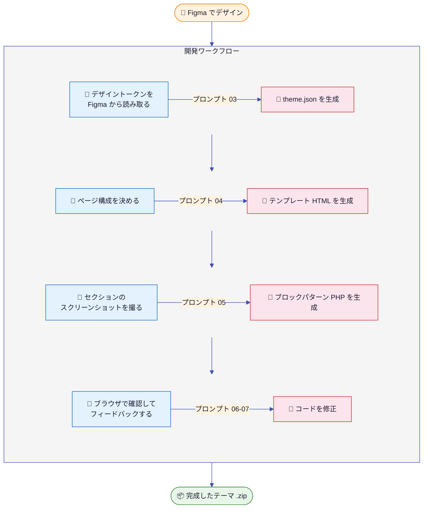

# WordPress Block Theme Development — AI-Driven Method

AI（Claude Code / Cursor）を活用した WordPress ブロックテーマ開発のメソッドです。
このドキュメントは**人間が行う作業**を中心にまとめています。

---

## 目次

1. [全体像](#全体像)
2. [Phase 0: プロジェクト初期設定](#phase-0-プロジェクト初期設定)
3. [Phase 1: 環境構築](#phase-1-環境構築)
4. [Phase 2: テーマの基本情報を決める](#phase-2-テーマの基本情報を決める)
5. [Phase 3: Figma でデザインを作る](#phase-3-figma-でデザインを作る)
6. [Phase 4: デザインをコードに変換する](#phase-4-デザインをコードに変換する)
7. [Phase 5: パターン開発](#phase-5-パターン開発)
8. [Phase 6: リファクタリングとレビュー](#phase-6-リファクタリングとレビュー)
9. [ADR（設計判断ログ）の運用](#adr設計判断ログの運用)
10. [ディレクトリ構成](#ディレクトリ構成)

---

## 全体像



基本方針: **人間がデザイン意図と判断を担い、AI がコード生成を担う。**

---

## Phase 0: プロジェクト初期設定

### あなたがやること

1. **このリポジトリをクローンまたはコピーする**

2. **`docs/prompts/00_rules.md` を開き、プロジェクト情報を記入する**

   以下の項目を自分のプロジェクトに合わせて書き換える。

   | 項目 | 記入例 |
   |---|---|
   | プロジェクト名 | `my-cafe-theme` |
   | テーマ種別 | （そのまま） |
   | WordPress バージョン | `6.7` |
   | PHP バージョン | `8.2` |

3. **`CLAUDE.md` と `.cursorrules` を確認する**

   `00_rules.md` の内容が反映されているか確認する。
   必要に応じて Claude Code に「`00_rules.md` をもとに `CLAUDE.md` を更新して」と指示する。

4. **Git リポジトリを初期化する**

   ```bash
   cd repo
   git init
   git add .
   git commit -m "chore: initial project setup"
   ```

---

## Phase 1: 環境構築

### あなたがやること

1. **`01_docker_wp_setup.md` を Claude Code に渡す**

   ```
   docs/prompts/01_docker_wp_setup.md を読んで、Docker 環境を構築してください。
   ```

2. **生成されたファイルを確認し、Docker を起動する**

   ```bash
   cp docker/.env.example docker/.env
   # .env の中身を確認し、必要に応じてパスワード等を変更
   ./scripts/dev-up.sh
   ```

3. **WordPress の初期設定を手動で行う**

   `http://localhost:8080` にアクセスし、以下を実施する。

   - 言語: 日本語を選択
   - サイト名・ユーザー名・パスワードを設定
   - ログイン後、「設定 → パーマリンク」を「投稿名」に変更
   - 「外観 → テーマ」で開発テーマが表示されることを確認（まだ有効化しない）

4. **ダミーコンテンツを投入する**

   テーマ開発にはテスト用の投稿データが必要。以下のいずれかを実施する。

   - [WordPress Theme Unit Test Data](https://github.com/WPTT/theme-unit-test) をインポート
   - 手動で投稿 3〜5 件、固定ページ 2〜3 件、カテゴリ・タグを作成
   - アイキャッチ画像を数枚設定する

5. **ADR を記録する**

   → `docs/decisions/001_docker_environment.md` に環境構成の判断を記録（[ADR の書き方](#adr設計判断ログの運用)を参照）

---

## Phase 2: テーマの基本情報を決める

### あなたがやること

1. **`02_block_theme_scaffold.md` を開き、テーマ情報を記入する**

   | 項目 | あなたが決めること |
   |---|---|
   | テーマ名 | 日本語 OK（例: 「カフェテーマ」） |
   | テーマスラッグ | 英数字とハイフン（例: `my-cafe-theme`） |
   | 説明 | 1〜2 文でテーマの概要 |
   | 作者名 | あなたの名前 or 組織名 |
   | テキストドメイン | テーマスラッグと同じ値 |

2. **記入済みのプロンプトを Claude Code に渡す**

   ```
   docs/prompts/02_block_theme_scaffold.md を読んで、テーマの骨格ファイルを生成してください。
   ```

3. **テーマを有効化して動作確認する**

   - WordPress 管理画面 →「外観 → テーマ」→ 開発テーマを有効化
   - フロントエンドにアクセスし、何かしらの表示が出ることを確認
   - 「外観 → エディター（サイトエディタ）」が開けることを確認

---

## Phase 3: Figma でデザインを作る

> **ここが最も重要なフェーズです。**
> Figma での作業品質がテーマの仕上がりを左右します。

### Step 3-1: Figma プロジェクトを準備する

1. Figma で新規ファイルを作成する（またはクライアントから受け取る）
2. 以下のページ（Figma 上のページ機能）を作る

   | ページ名 | 内容 |
   |---|---|
   | `Style Guide` | カラー・フォント・スペーシングの定義 |
   | `Components` | ボタン、カード等の UI パーツ |
   | `Desktop` | PC 表示のページデザイン |
   | `Mobile` | スマホ表示のページデザイン |

### Step 3-2: デザイントークンを定義する（Style Guide ページ）

Figma の Style Guide ページに、以下を**明示的に並べて配置**する。
AI に渡すスクリーンショットの元になるので、**値が読み取れるように**レイアウトする。

#### カラーパレット

Figma 上で色の四角形を並べ、横に名前と Hex 値を記載する。

```
■ Primary     #1a1a2e
■ Secondary   #16213e
■ Accent      #e94560
■ Background  #ffffff
■ Foreground  #1a1a2e
■ Muted       #f5f5f5
```

具体的な Figma 操作手順:

1. Rectangle ツール（R キー）で 80×80px の正方形を作成
2. 右パネル「Fill」で色を設定し、Hex 値をメモ
3. Text ツール（T キー）で横に色名と Hex 値を記載
4. 全色分を並べたら、すべて選択して Auto Layout（Shift+A）でグループ化
5. **Figma の Local Styles にも登録する**:
   右パネル「Fill」の色部分の ■ をクリック → 「+」ボタン → 名前を付けて登録
   （例: `Primary`, `Secondary`, `Accent`）

#### タイポグラフィ

フォントファミリー、ウェイト、サイズスケールを実際のテキストサンプルで示す。

```
Heading: Noto Serif JP
  H1 — 36px / Bold / 行間 1.3
  H2 — 28px / Bold / 行間 1.3
  H3 — 20px / Bold / 行間 1.4

Body: Noto Sans JP
  Large  — 20px / Regular / 行間 1.6
  Medium — 16px / Regular / 行間 1.6
  Small  — 14px / Regular / 行間 1.6
```

具体的な Figma 操作手順:

1. Text ツール（T キー）で「あいうえお ABCDE 12345」等のサンプルテキストを配置
2. 右パネル「Text」でフォントファミリー・サイズ・ウェイト・行間を設定
3. 各スタイルの横に仕様を記載（フォント名、サイズ、ウェイト、行間）
4. **Text Styles に登録する**:
   テキストを選択 → 右パネル「Text」横の点4つアイコン → 「+」→ 名前を付けて登録
   （例: `Heading/H1`, `Heading/H2`, `Body/Medium`）

#### スペーシング

余白のスケールを視覚的に示す。

具体的な Figma 操作手順:

1. Rectangle ツールで各スペーシング値の高さの長方形を作成（例: 高さ 10px, 16px, 24px ...）
2. 横に値を記載（`10px = 0.625rem`, `16px = 1rem` 等）
3. 色は薄い青やグレーにして視覚的に区別しやすくする

#### レイアウト幅

```
コンテンツ幅: 720px
ワイド幅:     1200px
```

具体的な Figma 操作手順:

1. Desktop ページのデザインフレーム内に、コンテンツエリアを示す破線の Rectangle を配置
2. 幅を `720px` に設定し、ラベルを付ける
3. 同様にワイド幅 `1200px` の Rectangle も配置

### Step 3-3: コンポーネントを設計する（Components ページ）

WordPress のコアブロックに対応するコンポーネントを作る。

| Figma コンポーネント | 対応する WP ブロック | 作り方のポイント |
|---|---|---|
| Button（Primary / Secondary / Outline） | `core/button` | Variants で3種類作成 |
| Card（画像 + タイトル + 抜粋） | `core/query` ループ内 | Auto Layout で縦並び |
| Navigation（ロゴ + メニュー） | `core/navigation` | 横並び Auto Layout |
| Hero Section | `core/cover` + `core/group` | 背景画像 + オーバーレイ |
| CTA Banner | `core/group` + `core/buttons` | 背景色 + 中央揃え |
| Feature Grid（3カラム） | `core/columns` | 3つの等幅カラム |
| Footer | `core/group` | 複数カラムのリンク群 |

具体的な Figma 操作手順:

1. Components ページで各パーツをデザイン
2. パーツを選択して「Create Component」（Ctrl/Cmd + Alt + K）
3. Variants が必要なもの（ボタン等）は Component を選択して右パネル「+」で Variant 追加
4. 命名は `Button/Primary`, `Button/Secondary` のようにスラッシュ区切りにする

> **ポイント**: WordPress のコアブロックでできることを意識してデザインする。
> 角丸カード内にオーバーラップする要素など、CSS で複雑な対応が必要なデザインは避ける。
> 迷ったら ADR に記録して判断する（→ `docs/decisions/` に記載）。

### Step 3-4: ページデザインを作る（Desktop / Mobile ページ）

以下のページを最低限デザインする。

| ページ | テンプレート | 必須度 |
|---|---|---|
| トップページ | `front-page.html` | 必須 |
| 投稿詳細 | `single.html` | 必須 |
| 固定ページ | `page.html` | 必須 |
| アーカイブ（一覧） | `archive.html` | 必須 |
| 404 | `404.html` | 推奨 |
| 検索結果 | `search.html` | 推奨 |

具体的な Figma 操作手順:

1. Desktop ページに Frame ツール（F キー）で 1440×auto のフレームを作成
2. フレーム名をページ名にする（例: `Front Page`, `Single Post`）
3. Components ページで作ったコンポーネントを Instance として配置
4. **各セクションを Group または Frame でまとめる**（後でセクション単位のスクショを撮るため）
5. Group/Frame の名前にセクション名を付ける（例: `Hero Section`, `Features`, `CTA`）

デザイン時の注意点:

- ヘッダーとフッターは全ページ共通にする（Component の Instance を配置）
- 各ページを**セクション単位で区切り**、セクション間に明確な境界を作る（この区切りがパターンの単位になる）
- モバイル版は最低でもトップページと投稿詳細を作る
- Mobile ページには 375px 幅のフレームを作成

### Step 3-5: スクリーンショットを撮って保存する

**ここで撮るスクリーンショットが AI への主要なインプットになる。**

#### 撮り方（3つの方法）

**方法 A: フレーム選択 → Export（推奨）**
1. 対象のフレームを左パネルで選択
2. 右パネル下部「Export」セクションの「+」をクリック
3. フォーマット: PNG、倍率: 2x を設定
4. 「Export {フレーム名}」をクリック

**方法 B: 選択範囲をコピー**
1. 対象を選択
2. 右クリック →「Copy/Paste as」→「Copy as PNG」
3. 画像編集ツール等にペーストして保存

**方法 C: Figma のスライス機能**
1. Slice ツール（S キー）で範囲を指定
2. Export で書き出し

#### 撮るべきスクリーンショット一覧

| ファイル名 | 対象 | 用途 |
|---|---|---|
| `docs/figma/styleguide.png` | Style Guide ページ全体 | `03` で theme.json 生成に使用 |
| `docs/figma/styleguide-colors.png` | カラーパレット部分 | 色が多い場合は分割 |
| `docs/figma/styleguide-typography.png` | タイポグラフィ部分 | フォントが読み取りやすいように |
| `docs/figma/page-front.png` | トップページ全体 | `04` でテンプレート生成に使用 |
| `docs/figma/page-single.png` | 投稿詳細ページ全体 | 同上 |
| `docs/figma/page-archive.png` | アーカイブページ全体 | 同上 |
| `docs/figma/section-hero.png` | ヒーローセクション単体 | `05` でパターン生成に使用 |
| `docs/figma/section-features.png` | 特徴セクション単体 | 同上 |
| `docs/figma/section-cta.png` | CTA セクション単体 | 同上 |
| `docs/figma/mobile-front.png` | トップページ モバイル版 | レスポンシブ確認用 |
| `docs/figma/mobile-single.png` | 投稿詳細 モバイル版 | 同上 |

#### Figma ファイルの URL を記録する

`docs/figma/links.md` を作成し、Figma の共有リンクを保存する。

```markdown
# Figma リンク集

- メインファイル: https://www.figma.com/file/xxxxx
- Style Guide: https://www.figma.com/file/xxxxx?node-id=0-1
- トップページ: https://www.figma.com/file/xxxxx?node-id=1-1
```

### Step 3-6: デザイントークンを抽出してプロンプトに記入する

`docs/prompts/03_theme_json_from_figma.md` を開き、「入力データ」セクションを埋める。

#### Figma から値を読み取る方法

| 値 | Figma での確認方法 |
|---|---|
| **カラー Hex 値** | オブジェクトを選択 → 右パネル「Fill」の色をクリック → Hex 値をコピー |
| **フォントファミリー** | テキストを選択 → 右パネル「Text」のフォント名を確認 |
| **フォントサイズ** | テキストを選択 → 右パネル「Text」のサイズ値を確認 |
| **フォントウェイト** | テキストを選択 → 右パネル「Text」のウェイト（Regular, Bold 等）を確認 |
| **行間** | テキストを選択 → 右パネル「Text」の行間（Line height）を確認 |
| **スペーシング** | 2つのオブジェクト間で Alt/Option キーを押しながらホバー → 距離が表示 |
| **フレーム幅** | フレームを選択 → 右パネル「W」の値を確認 |
| **角丸** | オブジェクトを選択 → 右パネル「Corner radius」の値を確認 |

記入例:
```yaml
colors:
  primary:    "#1a1a2e"
  secondary:  "#16213e"
  accent:     "#e94560"
  background: "#ffffff"
  foreground: "#1a1a2e"
  muted:      "#f5f5f5"

fonts:
  heading:
    family: "Noto Serif JP"
    weights: [400, 700]
    source: google
  body:
    family: "Noto Sans JP"
    weights: [400, 500, 700]
    source: google

font_sizes:
  small:    "14px"
  medium:   "16px"
  large:    "20px"
  x-large:  "28px"
  xx-large: "36px"

spacing:
  "10": "0.625rem"
  "20": "1rem"
  "30": "1.5rem"
  "40": "2rem"
  "50": "3rem"
  "60": "4rem"

layout:
  content_width: "720px"
  wide_width:    "1200px"
```

---

## Phase 4: デザインをコードに変換する

### あなたがやること

1. **theme.json を生成させる**

   記入済みの `03_theme_json_from_figma.md` を、Style Guide のスクリーンショットと一緒に Claude Code に渡す。

   ```
   docs/prompts/03_theme_json_from_figma.md と添付のスタイルガイド画像をもとに
   theme/theme.json を生成してください。
   ```

2. **ブラウザで確認する**

   - `http://localhost:8080` にアクセス
   - 管理画面 →「外観 → エディター → スタイル」を開く
   - カラーパレットが Figma と一致するか確認
   - タイポグラフィが Figma と一致するか確認
   - Google Fonts が正しく読み込まれているかを DevTools の Network タブで確認

   **ずれている場合**: スクリーンショットを撮り、「Figma ではこうなっているが、ブラウザではこう表示されている。theme.json を修正して」と指示する。

3. **テンプレートのレイアウトを構築させる**

   `04_template_generate.md` の指示フォーマットに従い、**ページごとに** Claude Code に指示する。
   Figma のページ全体のスクリーンショットを添付する。

   ```
   docs/prompts/04_template_generate.md の指示フォーマットに従って、
   theme/templates/front-page.html を生成してください。
   添付画像は Figma のトップページデザインです。
   現在の theme.json の内容: （ファイルを渡す or 「theme/theme.json を参照して」）

   Figma のセクション構成（上から順に）:
   1. ヒーローセクション: フルワイド背景画像 + 見出し + CTA ボタン
   2. 特徴紹介: 3 カラム、アイコン + テキスト
   3. 最新記事: カード型 3 件表示
   4. CTA バナー: アクセントカラー背景 + ボタン
   ```

   これを `single.html`, `page.html`, `archive.html`, `404.html`, `search.html` ごとに繰り返す。

4. **各テンプレートをブラウザで確認する**

   テンプレートを生成するたびに:
   - フロントエンドの該当ページを表示
   - Figma と見比べて、レイアウトの大枠が合っているか確認
   - ずれている箇所があればスクリーンショットを撮って修正を依頼

5. **ADR を記録する**

   → `docs/decisions/002_layout_approach.md`（レイアウト方針の判断）

---

## Phase 5: パターン開発

### あなたがやること

1. **パターン化するセクションを決める**

   `05_pattern_generate.md` の「パターン一覧」テーブルを埋める。
   Figma のトップページを見ながら、再利用するセクションを洗い出す。

   判断基準:
   - 複数ページで使い回すセクション → パターンにする
   - トップページ固有でも、ユーザーが他のページに挿入したいもの → パターンにする
   - 1 回しか使わず、他に流用もしないもの → テンプレートに直書きのまま

   記入例:
   | # | パターン名 | ファイル名 | カテゴリ | 説明 |
   |---|---|---|---|---|
   | 1 | ヒーロー | `hero-section.php` | `featured` | フルワイド背景 + 見出し + CTA |
   | 2 | 特徴紹介 | `features-grid.php` | `text` | 3 カラム、アイコン + テキスト |
   | 3 | CTA バナー | `cta-banner.php` | `call-to-action` | アクセントカラー背景 + ボタン |
   | 4 | 最新記事 | `latest-posts.php` | `query` | カード型 3 件 |

2. **セクション単位のスクリーンショットを用意する**

   Phase 3 の Step 3-5 で保存した `docs/figma/section-*.png` を使う。
   まだ撮っていないセクションがあれば、この段階で Figma からエクスポートする。

3. **パターンを 1 つずつ Claude Code に生成させる**

   `05_pattern_generate.md` の指示フォーマットを使い、**1 パターンにつき 1 回** 指示する。

   ```
   docs/prompts/05_pattern_generate.md の指示フォーマットに従って、
   theme/patterns/hero-section.php を生成してください。

   添付画像: docs/figma/section-hero.png
   テーマスラッグ: my-cafe-theme
   使用する theme.json プリセット:
   - 背景: var(--wp--preset--color--primary)
   - テキスト: var(--wp--preset--color--background)
   - 見出しサイズ: var(--wp--preset--font-size--xx-large)
   - ボタン: var(--wp--preset--color--accent)
   ```

   > これを全パターン分繰り返す。一度に複数のパターンを頼むより、1 つずつ生成して確認する方が精度が高い。

4. **パターンをブラウザで確認する**

   パターンを生成するたびに:
   - 管理画面 →「外観 → エディター → パターン」にパターンが表示されるか確認
   - 投稿エディタで「パターン」から挿入してみる
   - Figma のデザインと見比べる

5. **テンプレートをパターン参照に書き換えさせる**

   全パターンが完成したら:

   ```
   theme/templates/front-page.html 内の各セクションを
   <!-- wp:pattern --> 呼び出しに書き換えてください。
   パターンスラッグの一覧:
   - my-cafe-theme/hero-section
   - my-cafe-theme/features-grid
   - my-cafe-theme/latest-posts
   - my-cafe-theme/cta-banner
   ```

6. **書き換え後にフロントエンドを確認する**

   パターン参照に切り替えた後もレイアウトが同じであることを確認する。

7. **ADR を記録する**

   → `docs/decisions/003_pattern_granularity.md`（パターンの粒度の判断）

---

## Phase 6: リファクタリングとレビュー

### あなたがやること

1. **リファクタリングを依頼する**

   ```
   docs/prompts/06_refactor_to_tokens.md を読んで、テーマ全体のハードコード値を
   theme.json プリセットに置き換えてください。
   ```

   AI が検出結果のリストを返すので、内容を確認する。
   意図的にハードコードしたものがあれば「この値はそのままで OK」と伝える。

2. **ビジュアル比較する**

   リファクタリング前後で見た目が変わっていないことを確認する。
   以下のページをブラウザで開き、目視でチェックする。

   - [ ] トップページ（デスクトップ 1440px + モバイル 375px）
   - [ ] 投稿詳細ページ
   - [ ] アーカイブページ
   - [ ] 404 ページ

   > ヒント: DevTools のデバイスエミュレーションでモバイル幅を確認できる（F12 → モバイルアイコン）

3. **最終レビューを依頼する**

   ```
   docs/prompts/07_review_check.md を読んで、テーマ全体をレビューしてください。
   ```

4. **レビュー結果を確認し、修正を依頼する**

   AI が返すレビュー結果サマリーを見て:
   - **重要度「高」の問題**: 必ず修正する（例: ブロックマークアップの構文エラー）
   - **重要度「中」の問題**: 基本的に修正する（例: アクセシビリティの警告）
   - **重要度「低」の問題**: 判断して対応する（ADR に記録してスキップしてもよい）

5. **スクリーンショットを作成する**

   テーマに必要な `screenshot.png` を作成する。

   - サイズ: 1200×900px
   - 内容: テーマのトップページのスクリーンショット
   - 作り方: ブラウザでトップページを 1200px 幅で開き、DevTools でキャプチャ
     （DevTools → Ctrl/Cmd+Shift+P →「Capture screenshot」）
   - 保存先: `theme/screenshot.png`

6. **パッケージングする**

   ```
   scripts/package-theme.sh を実行してテーマの ZIP を作成してください。
   ```

   生成された ZIP を別の WordPress 環境にインストールして動作確認する。

7. **ADR を記録する**

   → `docs/decisions/004_custom_css_policy.md`（カスタム CSS を使った箇所とその理由）

---

## ADR（設計判断ログ）の運用

### ADR とは

Architecture Decision Record（ADR）は、設計上の判断とその理由を記録するドキュメントです。
「なぜこうしたのか」を後から追跡できるようにします。

### いつ書くか

以下のような場面で ADR を作成する。

- Docker 環境の構成を決めたとき（MySQL vs MariaDB、PHP バージョン等）
- Figma のデザインをコアブロックだけでは再現できず、代替案を選んだとき
- パターンの粒度（大きくまとめるか、細かく分けるか）を決めたとき
- カスタム CSS を追加する判断をしたとき
- AI の提案を修正したとき（なぜその修正が必要だったか）
- カスタムブロックの導入を検討・採用・却下したとき

### 書き方

`docs/decisions/000_template.md` をコピーし、連番でファイルを作成する。
以下のサンプル ADR を参考にしてください。

### ファイル一覧

| ファイル | 内容 | 作成タイミング |
|---|---|---|
| `000_template.md` | テンプレート（コピー元） | — |
| `001_docker_environment.md` | Docker 環境構成の判断 | Phase 1 完了時 |
| `002_layout_approach.md` | レイアウト実現方法の判断 | Phase 4 完了時 |
| `003_pattern_granularity.md` | パターンの粒度の判断 | Phase 5 完了時 |
| `004_custom_css_policy.md` | カスタム CSS の使用方針 | Phase 6 完了時 |

---

## ディレクトリ構成

```
repo/
  theme/                 # WP ブロックテーマ本体
  docker/                # Docker Compose 環境
  docs/
    prompts/             # AI 指示テンプレート（00〜07）
    decisions/           # ADR（設計判断ログ）
    figma/               # スクショ・リンク集
      styleguide.png
      page-front.png
      page-single.png
      section-hero.png
      section-features.png
      ...
      links.md
  scripts/               # 開発補助スクリプト
  CLAUDE.md              # Claude Code 用プロジェクトコンテキスト
  .cursorrules           # Cursor AI 用ルール
```

## ライセンス

GPL-2.0-or-later